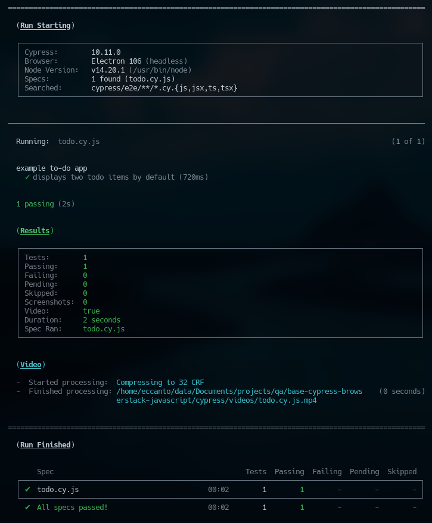
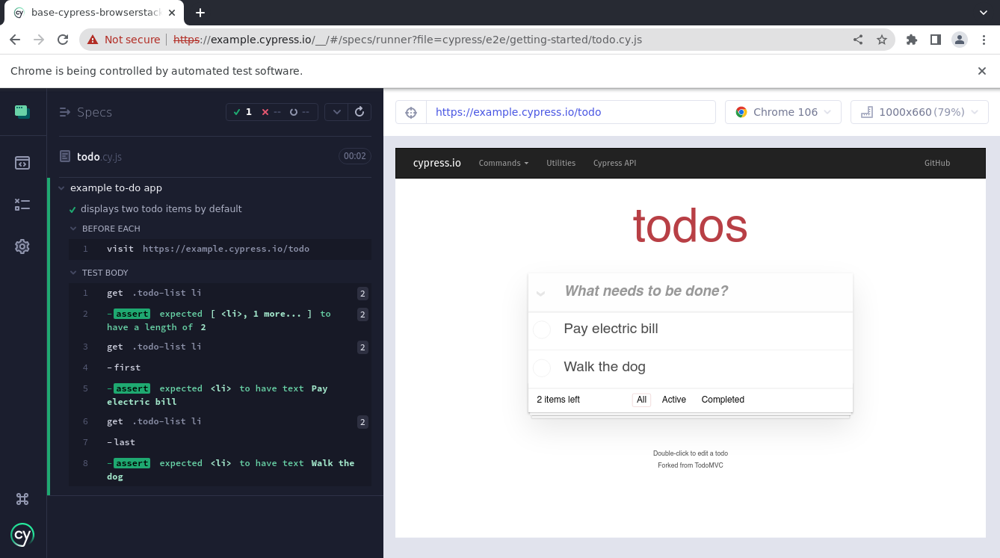
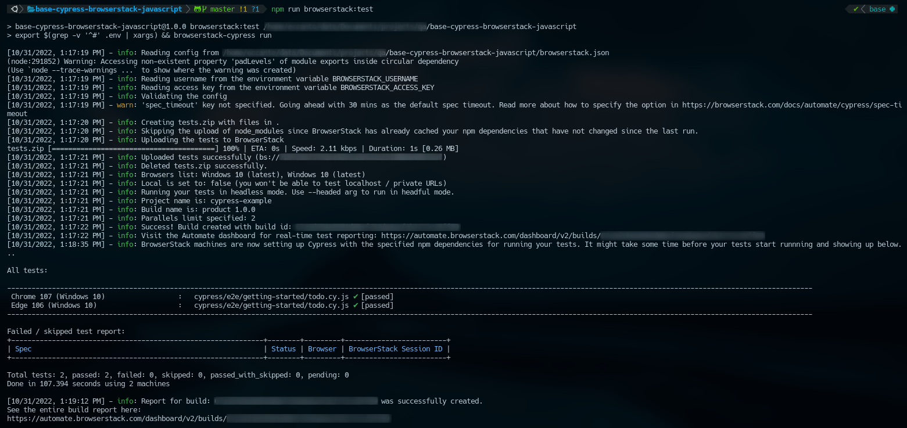
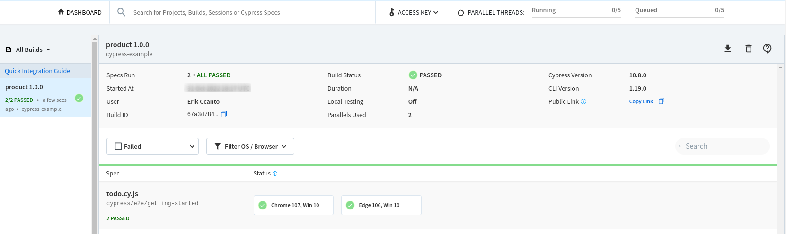

[](https://github.com/prettier/prettier)

# Base project: Browserstack + Cypress + Javascript

Basic example of using Cypress and Browserstack with Javascript.

# Table of contents

* [Overview](#overview)
* [How to run the tests](#how-to-run-the-tests)
  * [Cypress](#cypress)
    * [Installation](#installation)
    * [Running tests](#running-tests)
    * [Running tests manually](#running-tests-manually)
  * [Browserstack](#browserstack)
    * [Installation](#installation-1)
    * [Configuration](#configuration)
    * [Running tests](#running-tests-1)
* [Static code analysis tools](#static-code-analysis-tools)
  * [Set up the Git hooks custom directory](#set-up-the-git-hooks-custom-directory)
  * [ESLint](#eslint)
    * [Find Problems](#find-problems)
    * [Fix Automatically](#fix-automatically)
* [License](#license)

# Overview

Run [todo.cy.js](https://github.com/cypress-io/cypress-example-kitchensink/blob/master/cypress/e2e/1-getting-started/todo.cy.js)
Cypress example using Cypress locally and [Browserstack](https://www.browserstack.com/).

The objective of using Browserstack is to run the tests with Chrome and Edge latest version on Windows 10.

# How to run the tests

## Cypress

### Installation

```bash
npm install
```

### Running tests

```bash
npm run cypress:test
```



### Running tests manually

Open **`Cypress`** and run the tests manually:

```bash
npm run cypress:open
```



## Browserstack

## Installation

```bash
npm install -g browserstack-cypress-cli
```

### Configuration

An `.env` file is required in the project base directory, this file will contain the Browserstack credentials.

```bash
# file: .env

BROWSERSTACK_USERNAME=<BROWSERSTACK_USERNAME>
BROWSERSTACK_ACCESS_KEY=<BROWSERSTACK_ACCESS_KEY>

```

How to obtain these values?:
- `BROWSERSTACK_USERNAME` and `BROWSERSTACK_ACCESS_KEY`: register at [Browserstack](https://www.browserstack.com/).

### Running tests

```bash
npm run browserstack:test
```





# Static code analysis tools

These are the linters that will help us to follow good practices and style guides of our source code. We will be using the following static analysis tools, which will be executed when generating a new push in the repository (git hooks).

## Set up the Git hooks custom directory

After cloning the repository run the following command in the repository root:

```bash
git config core.hooksPath .githooks
```

## ESLint

### Find Problems

ESLint statically analyzes the code to find problems.

```bash
npm run lint
```

### Fix Automatically

Many problems ESLint finds can be automatically fixed.

```bash
npm run lint:fix
```

# License

[MIT](./LICENSE)

